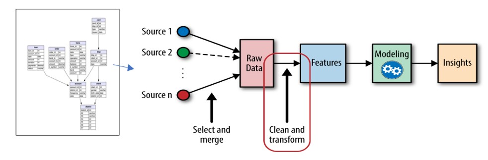
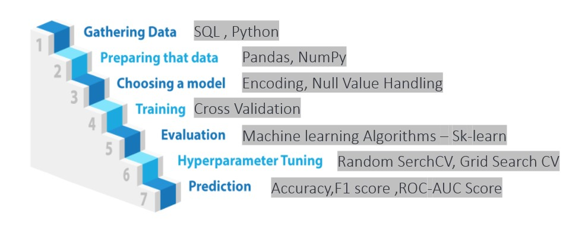

# ML-Loan_Default_Prediction
End-to-End Machine Learning Project with Bank Data

## Domain Background

Problems can be solved with machine learning Financial industry?

Machine learning use cases in banking are driving the financial aspects. The banking sector is turning to machine learning models in finance to improve security, easy and fast support, less processing time, and many more

Here are some problems of the banking industry that can solve by the ML Model

        Fraud Prevention - Detect fraud transactions
	    Credit Scoring - Can make quick decisions on credit scoring and save companies time and financial resources
	    Payment Processing – Payment providers drive down transaction costs and attract more business 
	    Process Automation – Automate the process and improve productivity
	    Investing – Provide financial advisory services to investors

Financial institutions incur significant losses due to the default of vehicle loans every year.

## Problem Statement

Goal: To accurately anticipate problematic borrowers who are likely to default in the future, our goal is to build a machine learning model that can accurately predict borrowers that are likely to default on the loan using the borrower’s financial history.

## Data

I used a bank dataset that can be found in "Loan Default DataSet" Folder

Dataset has total 8 csv files. 

To get more understanding of database please read the "Dataset Detail Information" pdf from "Loan Default DataSet" Folder

## Installation
This project requires Python and the following Python libraries installed:

    NumPy
    Pandas
    matplotlib
    scikit-learn

You will also need to have software installed to run and execute a Jupyter Notebook.

If you do not have Python installed yet, it is highly recommended that you install the Anaconda distribution of Python.

## Loan Default Prediction Project Life Cycle

## Loan Default Prediction Project Process

## Contact

Pooja Sureja - www.linkedin.com/in/poojasureja11 - surejapoojads@gmail.com

Project Link: https://github.com/PoojaDS22/ML-Loan_Default_Prediction.git
